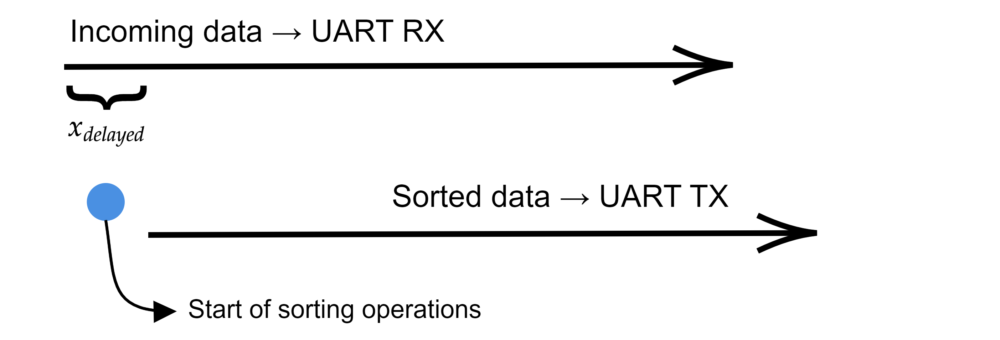
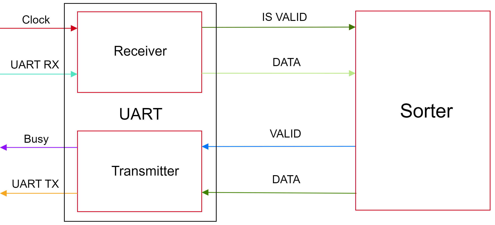
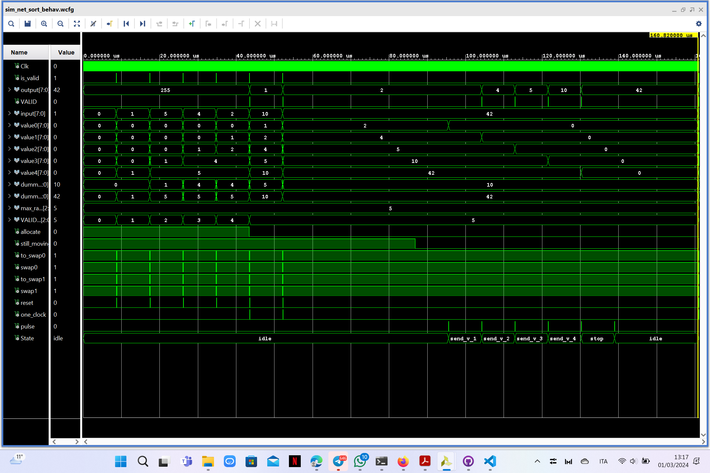

# **Sort timestamps in FPGA**

<h1 align="center">Programmable Hardware Devices - PoD<br> University of Padua <br> 2023/2024</h1>

<p align="center">
  
   
  
</p>

The goal of this project is to use a FPGA to perform a sorting operation: the FPGA receives in input a series of numbers and outputs them sorted in ascending order.

The numbers processed simulate a real physical problem in which the FPGA registers and sends back the incoming stream via the [UART protocol](https://github.com/GiosueSardoInfirri/Sort-in-FPGA/tree/main/UART). The input numbers are nothing else than timestamps that are far from their real ordered position by a maximum fixed $x_{delayed}$ distance. This problem is encountered when in an experiment a bottleneck of incoming data originates, leading to a shuffle of the timestamps. Right after this bottleneck a sorting operation is often performed in order to put experimental data in the correct order.

## Sorting algorithm



The whole idea of the implemented algorithm is the following: knowing $x_{delayed}$ (here $x_{delayed}\overset{!}{=} 5$), the first $x_{delayed}$ timestamps are received and stored into the FPGA. Each of these is properly sorted as soon as they get into the `Sorter` component (see below) so that after a time $$T \sim x_{delayed} \cdot \text{byte length}\cdot \text{Clk}$$ we have $x_{delayed}$ automatically sorted numbers. The FPGA is now ready to transmit back the first (the lowest one) timestamp and consequentially free up space for a new incoming number.

The maximum capacity of the algorithm is given by the receiver required-time to process the incoming bits of a single byte and is approximately

```math
x_{delayed}^{max} \leq \underbrace{11 \: [bit]}_{\text{SM states}} \cdot \underbrace{868\: [Clk/bit]}_{\text{Baudrate}^{-1}}\quad\div \underbrace{2\: [Clk/bytes]}_{\text{swaps per stored byte}} = 4774 \text{ bytes}
```

Therefore, the `UART TX` accomplishes this operation and this whole scheme goes on until the FPGA does not see any incoming new byte. Actually, the FPGA stops receiving data and outputs the last $x_{delayed}$ numbers when two identical timestamps are received. This ending procedure can be changed and has been implemented in this way so to avoid further latency in the final bitstream transmission of the FPGA.

This algorithm takes inspiration from the `Bubble sorting` algorithm and takes advantage of the time-bottleneck introduced by the communication through the serial port to fasten the reorder of the timestamps. If the normal `Bubble sorting` algorithm takes $\mathcal{O}(n^2)$ clock cycles, our implementation only needs $\mathcal{O}(n)$, whith the previously described limitations.

### UART component

Both the `UART Receiver` and `UART Transmitter` are the very same presented [here](https://github.com/GiosueSardoInfirri/Sort-in-FPGA/tree/main/UART) apart from the `Sorter` component placed between them.



The above simplified scheme points out the signals connections between the three components:

* The `Receiver` takes in input the Clock and the incoming bits. Then, a byte `DATA` and a `Data valid` signal are sent.
* Instead of latching these signals directly to the transmitter, they are connected to the `Sorter` component where the sorting algorithm takes place.  Here a maximum of $x_{delayed}$ data are stored. 
    * For the first $x_{delayed}$ bytes, no output is delivered, but data are sorted in this componet;
    * Right afterward, a variable called `allocate` changes and this indicates the availability of an output. A `VALID` one-clock signal is sent to the transmitter in combination with the lowest sorted `DATA` stored;
* The `Transmitter` finally outputs, as soon as the `VALID` raises, `DATA` (bit per bit) as well as a `busy` signal, showcasing the activity of this last component.

### Sorter component



The above simulation shows the behaviour of the sorting algorithm for a simple case of $(x_{delayed} + 1)$ bytes sent. The program is able to store and sort the different inputs, giving in output the correct sorted byte. The former is divid into different processes accounting for different tasks:

* `allocation` process: counter responsible for storing the initial $x_{delayed}$ bytes. It raises the `allocate` flag when this number of bytes are stored;
* `am_I_still_moving` process: checks if stop conditions are met. If so, the `still_moving` flag is lowered and the program outputs the last $(x_{delayed} - 1)$ bytes; 
* `pulse_generator` process: triggered by `am_I_still_moving`, is a counter that enables a one-clock `pulse` signal which allows to pass through different states of a state *SM*;   
* `switch` process:
    * at the beginning of the algorithm the saved positions are initialized with zeros;
    * until $(x_{delayed} - 1)$ bytes are received, the new incoming input is saved on top of the saved positions and it is confronted with the previously saved bytes, from the smaller to the bigger:
        * if the input byte is bigger than the confronted one, then they are switched;
        * othersie it is simply stored;
    * when $(x_{delayed} - 1)$ bytes are received and a new input arrives, it is saved on top of the saved positions and it is confronted with the previously saved bytes, from the smaller to the bigger:
        * if the input byte is bigger than the confronted one, then they are switched;
        * othersie it is simply stored;
        * at the end of the switch operations, the smaller stored byte is given in output, concurrently with the `VALID` one-clock signal;
    * when the `am_I_still_moving` process is triggered, this loop-storing mechanism stops and the `pulse` signal paces the sending of the last $(x_{delayed} - 1)$ bytes.

To recap, as `allocate` turns off, the first `VALID` signal is sent with the lowest byte received (*output = 1* in the simulation). When the UART does not see any new incoming byte, the `still_moving` variable is turned off too and a `pulse` generation starts. This variable allows to change the states of an *ad hoc* State Machine (last row in the above simulation) which sends out to the **UART Transmitter** the last $(x_{delayed} - 1)$ sorted timestamps.  

To **reset** the program a reset button has been programmed too. To avoid pressing it every now and then, each input series has been artificially modified to end with a $0$, representing an inner trigger forcing the reset operation. When this happens, the FPGA is ready again to receive new timestamps and perform all the afore mentioned operations.  

<!-- ### Python script
Following the prior knowledge of the physical bottleneck problem, the input disordered timestamp sequence has been generated in `python` so that each number position is far from its sorted position by at most $x_{delayed}$ moves.

Using then `pySerial`, each byte is sent to and then read from the FPGA via the `write` and `read` methods: this process has been implemented with a variable number of sent bytes and responded as expected. -->

## Futher developments

Further developments for this project could be:

* Generalize the maximum range of numbers, so augment the capabilities of the UART protocol to store data bigger than $2^7 -1$, by introducing a fourth and a fifth component that aim to collect more bytes going from the UART to the sorter unit and vice versa;
* Implement *stop* and *reset* in a more efficient way, using buttons or other methods, based on the application one wants to implement;
* The sorter algorithm *per se*, which is similar to the `Bubble sorting` algorithm. 
