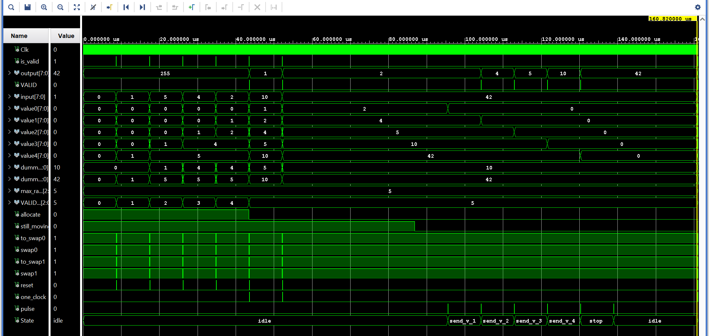

# **Sort timestamps in FPGA**

<h1 align="center">Numerical Methods in Soft Matter - PoD  University of Padua   2023/2024</h1>

  
   
  

The goal of this project is to use an FPGA to perform a sorting operation: the FPGA receives in input a series of number and outputs them sorted in ascending order.

The numbers processed simulate a real physical problem in which the FPGA registers and sends back the incoming stream via the [UART protocol](https://github.com/GiosueSardoInfirri/Sort-in-FPGA/tree/main/UART). The input numbers are nothing else than timestamps that is far from its real ordered position by a maximum fixed $x_{delayed}$. This problem is encountered when in an experiment a bottleneck of incoming data originates, leading to a shuffle of the timestamps. Right after this bottleneck a sorting operation is often performed in order to put experimental data in the correct order.

## Sorting algorithm

The whole idea of the implemented algorithm is the following: knowing $x_{delayed}$ (here $x_{delayed}\overset{!}{=} 5$), the first $x_{delayed}$ timestamps are received and stored into the FPGA. Each of these is properly sorted so that after a time $$T\sim x_{delayed} \cdot \text{byte length}\cdot \text{Clk}$$ stored numbers are all sorted. The FPGA is now ready to transmit back the first (the lowest one) timestamp and consequentially free up space for a new incoming number.

Therefore, the `UART TX` accomplishes this operation and this whole scheme goes on until the FPGA does not see any incoming new byte. Actually, the FPGA stops receiving data and outputs the last $x_{delayed}$ numbers when two identical timestamps are received. This ending procedure can be changed and has been implemented in this way so to avoid further latency in the final bitstream transmission of the FPGA.

### UART component

Both the `UART Receiver` and `UART Transmitter` are the very same presented [here](https://github.com/GiosueSardoInfirri/Sort-in-FPGA/tree/main/UART) apart from the `Sorter` component placed between them.

The above simplified scheme points out the signals connections between the three components:

* The `Receiver` takes in input the Clock and the incoming bits. Then, a byte `DATA` and a `Data valid` signal are sent.
* Instead of latching these signals directly to the transmitter, they are connected to the `Sorter` component.
    * For the first $x_{delayed}$ bytes, data are stored and sorted in this componet (No output);
    * Right afterward, a variable called `allocate` changes and this signals the availability of an output. A `VALID` signal is sent as well as the lowest sorted `DATA` received. 
* The `Transmitter` then outputs `DATA` bit per bit as well as a `busy` signal, showcasing the activity of this last component.

### Sorter component

The above simulation shows the behaviour of the sorting algorithm for a simple case of $(x_{delayed} + 1)$ bytes sent. The program is able to store and sort the different inputs. As `allocate` turns off, the first `VALID` signal is sent with the lowest byte received (*output = 1* in the simulation). When the UART does not see any new incoming byte, the `still_moving` variable is turned off too and a `pulse` generation starts. This variable allows to change the states of an *ad hoc* State Machine (last row in the above simulation) which sends out to the **UART Transmitter** the last $(x_{delayed} - 1)$ sorted timestamps, one for each state of the machine.  