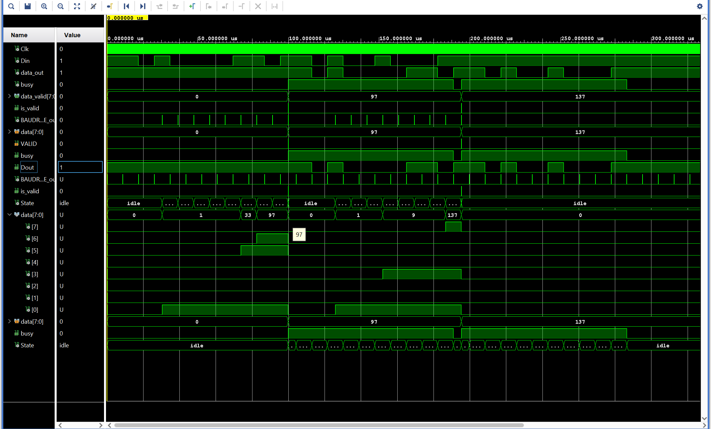

# UART protocol

The Universal Asynchronous Receiver-Transmietter (`UART`) has been implemented in `VHDL` following the general protocol for asynchronous serial communication.

The interconnection has been realized within the *Arty-A7 - FPGA* by implementing first the **Receiver** protocol and then the **Transmitter** one.

## Receiver
Taking in input both the *Clock* and the input *bits*, the Receiver transmits the passed message into the FPGA bit per bit. To achieve this two compoments have been latched together. 

* **Sampler generator**: is a pulse generator that mimics the input clock and is used to sample the input data, bit per bit via a proper state machine. Both the pulse generator and the state machine are followed by a **delay line** which allows to sample each bit at their *best sampling point*, in between a rising and a falling arriving signal. 

    

    The ouput of this component is a **Baud Rate** signal which is a pulse communicating when the data is ready to be sampled. The real sampling operation is therefore properly achieved when a $bit = 0$ is received allowing to enter into the following state machine.  

* **RX State Machine**: each time the previous component outputs a Baud Rate signal a single bit is sampled. Overall, through ten different states, a single byte is sampled (8 states for the byte + idle & stop states). The *start* state is considered to be already given when the Baud generator process begins.

In the above picture a receiver protocol has been simulated. One can see that the Baud Rate signal is in middle of the *Din* one, representing the input bit. When a byte has been sampled, the Baud Rate generator stops executing and both the `is_valid` and `data_valid` signals raise.  

## Transmitter
The `is_valid` signal tells the FPGA the a new byte has been sampled. Its value is stored in the `data_valid` variable. These two outputs of the Receiver protocol can be used within the FPGA to perform different tasks. Here we are only interested in transmitting the input byte back (echo).

The UART Transmitter takes in input both the outputs of the UART Receiver and outputs a `busy` signal and the processed `data`. To do so, two other components are needed:

* **Baud Rate generator**: a simple counter that outputs a Baud Rate signal similar to the one before programmed. The only difference is that now a delay line is not needed anymore. 

* **TX State Machine**: as in the receiver protocol this state machine allows to sample each incoming byte bit per bit once a Baud Rate signal is received. The state machine is very similar to the one implemented before but now has also a stop state, accounting for the baseline default $Dout=1$ signal of no communication.

## UART
The following simulation shows the whole UART implementation protocol with the two designed State Machines and the communication with receiver and transmitter, representing therefore an efficient `Loopback test evolution`.

